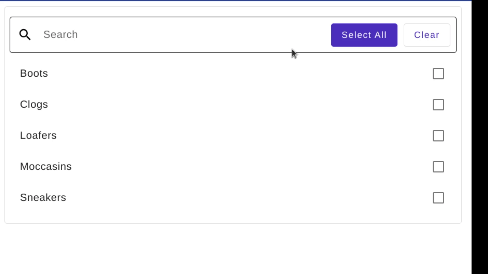

# NgxMatSelectionListSearch


## 💡 What does it do?
An Angular component that adds a built-in search/filter input field to the [```mat-selection-list```](https://material.angular.io/components/list/api#MatSelectionList) component of the [Angular Material](https://material.angular.io) library.


## 🔥 Features  
- Search/Filter for ``mat-selection-list`` without adding explicit filter logic.  
- ``Select All`` and ``Clear All`` actions .  
- ``Loader`` and ``Debounce`` on search.
- Custom no records UI.
- Search on input or Search on enter
- Custom ``Placeholder`` for search field

## Demo

* [https://stackblitz.com/~/github.com/developer-1-nng/ngx-mat-selection-list-search-demo](https://stackblitz.com/~/github.com/developer-1-nng/ngx-mat-selection-list-search-demo)  

## 📦 Installation  

Install the package using npm or yarn:

```bash
npm install ngx-mat-selection-list-search
# or
yarn add ngx-mat-selection-list-search
```


## 🚀 Quick Start  

Here’s how to get started with ngx-mat-selection-list-search

```javascript
import { MatListModule } from '@angular/material';
import { NgxMatSelectionListSearchModule } from 'ngx-mat-selection-list-search';

@NgModule({
  imports: [
    ...
    MatListModule,
    NgxMatSelectionListSearchModule
  ],
})
export class AppModule {}
```

Use the ``ngx-mat-selection-list-search`` component inside a ``mat-selection-list``.

```html
<mat-form-field>
  <mat-selection-list>
    <ngx-mat-selection-list-search></ngx-mat-selection-list-search>
    <mat-list-option *ngFor="let shoe of typesOfShoes" [value]="shoe">
      {{shoe}}
    </mat-list-option>
</mat-selection-list>
</mat-form-field>
```


## ⚙️ Configuration  

```javascript
 /**
   * Placeholder for the search field
   */
  @Input() placeholder: string = 'Search';

  /**
   * Appearance for the search field
   */
  @Input() fieldAppearance: MatFormFieldAppearance = 'outline';

  /**
   * Debounce time in milliseconds
   */
  @Input() debounceTime: number = 300;

  /**
   * Whether to display select all action button
   */
  @Input() selectAllAction: boolean = false;

  /**
   * Whether to display clear action button
   */
  @Input() clearAllAction: boolean = false;

  /**
   * Whether to display loader on search
   */
  @Input() showLoader: boolean = false;

  /**
   * When sets to true search will happned on 'Enter' key press and not while typing the search text
   */
  @Input() searchOnEnter: boolean = false;

  $enterKeyObeservable = new Subject();

  /**
   * Custom no records found template set using ```NgxMatSelectionListNoRecordsFoundDirective```
   */
  @ContentChild(NgxMatSelectionListNoRecordsFoundDirective)
  customNoRecordsFound!: NgxMatSelectionListNoRecordsFoundDirective;

```

## Custom No Records Found Template

Use ``ngxMatSelectionListNoRecordsFound`` to pass custom template for no records found UI.

```html
<mat-selection-list>
      <ngx-mat-selection-list-search [showLoader]="true">
        <span ngxMatSelectionListNoRecordsFound>
         <div class="custom-no-records-found"></div>
        </span>
      </ngx-mat-selection-list-search>
      <mat-list-option *ngFor="let shoe of typesOfShoes" [value]="shoe">
        {{shoe}}
      </mat-list-option>
  </mat-selection-list>
```

## Compatibility

* `@angular/core`: `^16.0.0`
* `@angular/material`: `^16.0.0` with `MatListModule` (`@angular/material/list`)

## 🛡 License  

This project is licensed under the [MIT License](../../LICENSE.md).

# Devlopement

This library was generated with [Angular CLI](https://github.com/angular/angular-cli) version 16.2.0.

## Code scaffolding

Run `ng generate component component-name --project ngx-mat-selection-list-search` to generate a new component. You can also use `ng generate directive|pipe|service|class|guard|interface|enum|module --project ngx-mat-selection-list-search`.
> Note: Don't forget to add `--project ngx-mat-selection-list-search` or else it will be added to the default project in your `angular.json` file. 

## Build

Run `ng build ngx-mat-selection-list-search` to build the project. The build artifacts will be stored in the `dist/` directory.

## Publishing

After building your library with `ng build ngx-mat-selection-list-search`, go to the dist folder `cd dist/ngx-mat-selection-list-search` and run `npm publish`.

## Running unit tests

Run `ng test ngx-mat-selection-list-search` to execute the unit tests via [Karma](https://karma-runner.github.io).

## Further help

To get more help on the Angular CLI use `ng help` or go check out the [Angular CLI Overview and Command Reference](https://angular.io/cli) page.
